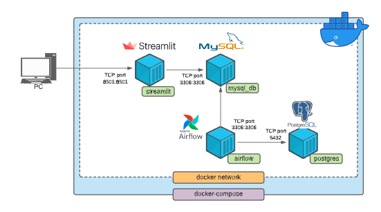
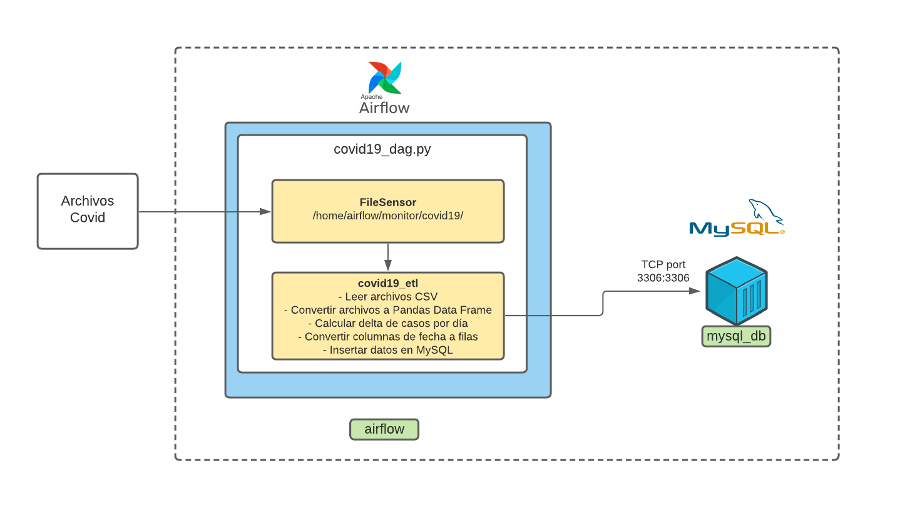

# Documentación Técnica

## Docker Compose
La configuración de los contenedores se encuentran definidos en el archivo [docker-compose.yml](../../docker-compose.yml)



Antes de poner a correr los contenedores, es necesario hacer build de los contenedores **airflow** y **streamlit**, 
esto se hace ejecutando el comando:
```
docker-compose build
```

Una vez que se ha completado exitosamente el build de ambas imagenes podemos ejecutar el siguiente comando para
inicializar los contenedores:

```
docker-compose up
```
Si deseamos que docker-compose corra en el background, podemos ejecutar el comando:
```
docker-compose up -d
```

## MySQL

Al iniciar el contenedor se crea una tabla con el esquema definido en  [schema.sql](../../mysql/scripts/schema.sql)

## Airflow



## Streamlit

Mapa - plotly expres

tabala - streamlit-aggrid