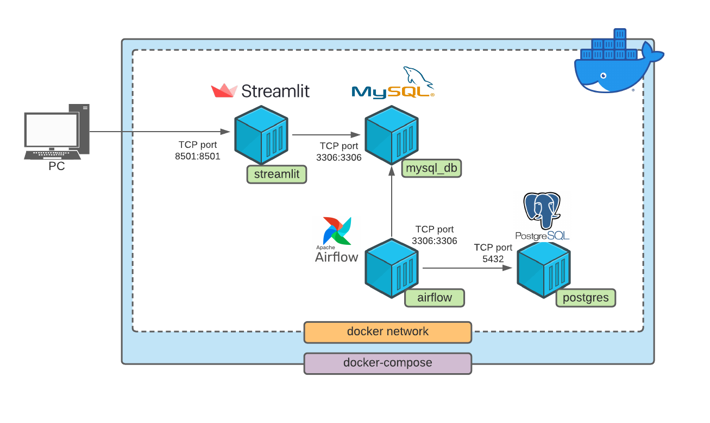

# Documentación Técnica

## Docker Compose
La configuración de los contenedores se encuentran definidos en el archivo [docker-compose.yml](../../docker-compose.yml)



El docker-compose crea cuatro contenedores (i) postgres, (ii) airflow, (iii) mysql_db y (iv) streamlit.  Entre otras cosas, en éste archivo se definen los puertos utilizados, path de los volumes y credenciales de las bases de datos.  

Cómo se muestra en la topología, toda la arquitectura funciona dentro de la misma red local.

Antes de poner a correr los contenedores, es necesario hacer build de los contenedores **airflow** y **streamlit**, 
esto se hace ejecutando el comando:
```
docker-compose build
```

Una vez que se ha completado exitosamente el build de ambas imagenes podemos ejecutar el siguiente comando para
inicializar los contenedores:

```
docker-compose up
```
Si deseamos que docker-compose corra en el background, podemos ejecutar el comando:
```
docker-compose up -d
```

## MySQL

Al iniciar el contenedor se crea una tabla (covid19.global_data) con el esquema definido en  [schema.sql](../../mysql/scripts/schema.sql).  La tabla contiene id, país, estado, latitud, longitud, fecha, número de casos y el status.

## Airflow


Airflow tiene un DAG definido en [covid19_dag.py](../../airflow/dags/covid19_dag.py) que tiene definido un sensor y un ETL.  El sensor recibe los archivos CSV dentro de la carpeta [covid19](../../airflow/monitor/covid19), luego de recibir los archivos los manda al ETL  quién se encarga de leerlos, convertirlos a Data Frames de Pandas, realiza el cálculo del delta (diferencia) de casos por día, convertir las columnas de fechas a filas y finalmente insertar los datos resultantes a la base de datos creada en MySQL [schema.sql](../../mysql/scripts/schema.sql).

El ETL funciona por medio de la función etl_process().  Lo primero que realiza es un listado de los archivos "*_global.csv", se descartan lo que no hacen match.  Los archivos encontrados son leídos y convertidos a Data Frames de Pandas.  

Para la elaboración de gráficas de frencuencia se requería el delta de casos por día, para lo cual fue necesario realizar un diff en todo el eje de columnas tomando en cuenta el valor inicial de cada país.

Antes de insertar los datos a la base de datos, todas las fechas son transformadas a formato "fecha" utilizando el método to_date de pandas.


## Streamlit

Se utilizó la biblitoteca Streamlit para la creación del dashboard.  La configuración está definida en el archivo [main.py] (../../streamlit/src/main.py) y básicamente lo que hace es leer los datos de la base de datos *mysql_db* y visualizarlos gráficamente en http://localhost:8501/.  

En Streamlit se definen filtros, sidebars, mapas y gráficas.  Para estó fue necesario utilizar otras librerías como:

- Pydeck: Nos permite la visualización de datos geoespaciales.
- Numpy: Manejo de vectores, matrices y demás tensores.
- SQLAlchemy: Librería que facilita la comunicación entre Python y las bases de datos.
- Pandas: Útil para la maniputación y análisis de datos.
- Plotly.express: Creación de simples e interactivas visualizaciones.
- Datetime: Nos permite trabajar con fechas como objetos.
- AgGrid: Nos permite la interacción de columnas, sorting, row selection, etc., en la tabla de nuestra tabla de datos.