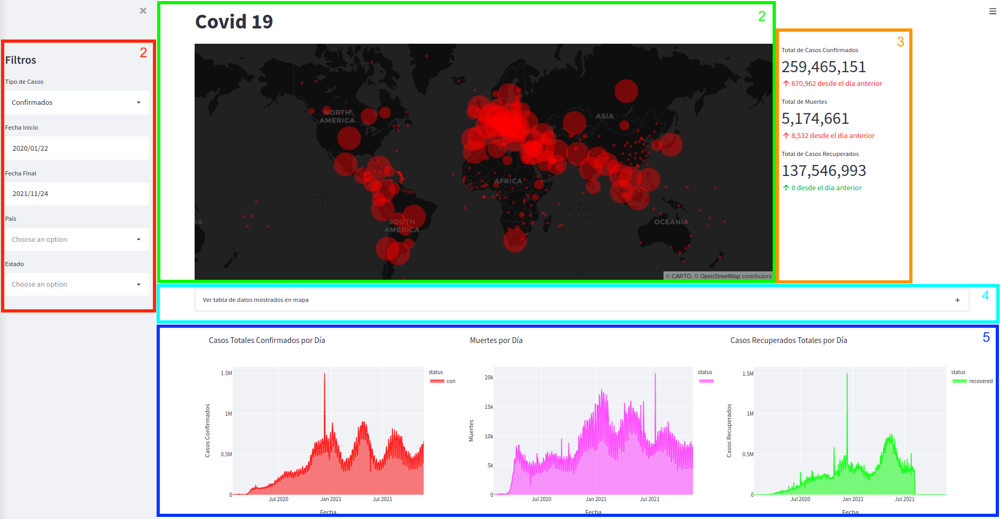
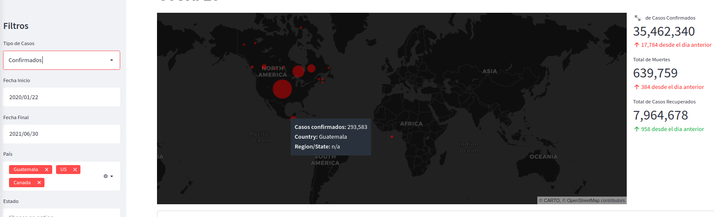
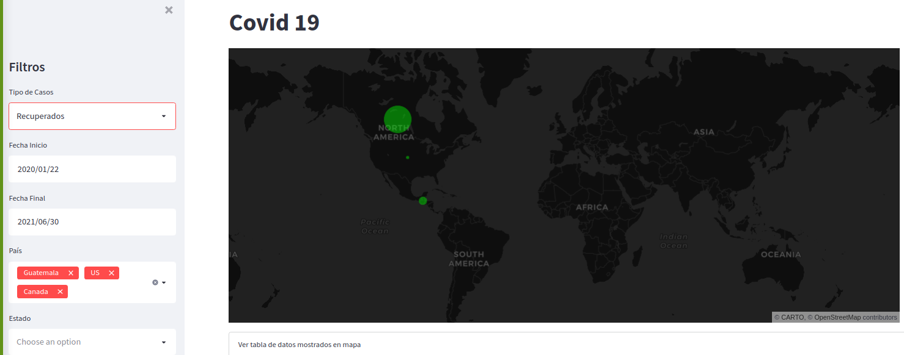

# Documentación de Usuario

## Dashboard

El dashboard que se presenta está formado por 4 secciones:
1. Filtros
2. Mapa
3. Métricas
4. Gráficas

### 1. Filtros

Los filtros que se pueden realizar son:
1. **Tipos de casos:** Filtra los tipos de casos que se desea mostrar, existen 3 tipos los cuales son:
   1. **Confirmados:** Corresponde a los casos confirmados como positivos a la fecha.
   2. **Recuperados:** Corresponde a los casos confirmados como positivos pero que ya se han recuperado y salen negativos en una prueba posterior a su recupración.
   3. **Muertes:** Corresponde a los casos confirmados como positivos pero que lamentablemente han fallecido.
2. **Fecha Inicio:** Coloca una cota inicial, es decir, a partir de la fecha seleccionada se mostrarán los tipos de casos que hayan sido seleccionados en el primer filtro.
3. **Fecha Final:** Coloca una cota final, es decir, hasta la fecha seleccionada se mostrarán los tipos de casos que hayan sido seleccionados en el primer filtro.
4. **País:** Filtra el(los) país(es) sobre los cuales se mostrarán los tipos de casos que hayan sido seleccionados en el primer filtro y que se encuentren dentro de las fechas seleccionadas como inicio y fin.
5. **Estado:** Filtra para los casos en los que aplique que el país esté dividido por Estados.

### 2. Mapa

Se muestra en un mapa mundial los tipos de casos dentro de las fechas para el País y Estado seleccionados en los filtros, se muestra un punto de diferente color dependiendo del tipo de casos que se seleccionó y el tamaño del punto dependerá de la cantidad de casos que existan, mientras más casos sean mayor será el tamaño del punto. De forma interactiva al colocar el cursor sobre cada uno de los puntos en el mapa, se despliega la información.

### 3. Métricas

Se muestra a la derecha del mapa, los totales para cada tipo de caso y el cambio que ha existido respecto al día anterior ya sea incremento o decremento.

### 4. Gráficas

En las gráficas se muestran 3 tipos diferentes:
1. Casos Totales Confirmados por Día
2. Muertes por Día
3. Casos Recuperados Totales por Día

De forma interactiva al colocar el cursor sobre la gráfica nos despliega información del caso, al hacer una ventana de selección sobre la gráfica se hace zoom y muestra únicamente la porción seleccionada.

